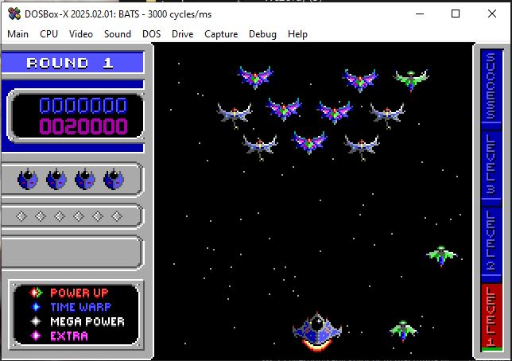
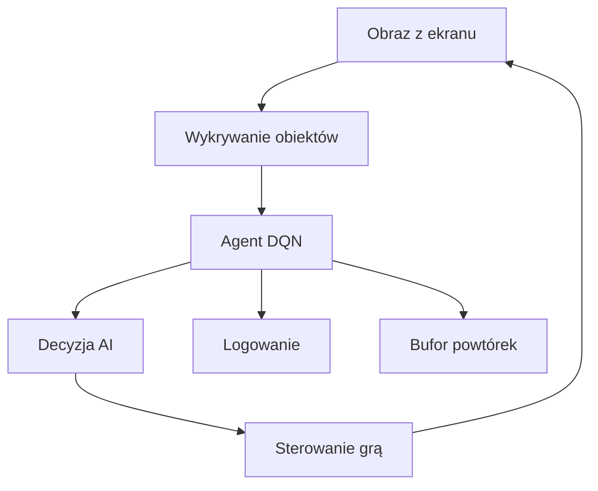

# Space Invaders AI Pro

Zaawansowany system sztucznej inteligencji do gry Space Invaders, oparty na Deep Q-Learning (DQN), z rozbudowanym monitoringiem, automatyzacją i testami. Projekt umożliwia pełną automatyzację rozgrywki w klasyczną wersję Space Invaders uruchamianą w DOSBox, analizę obrazu ekranu, podejmowanie decyzji przez agenta AI oraz logowanie i testowanie skuteczności algorytmu.

## Opis

Space Invaders AI Pro to narzędzie badawcze i demonstracyjne, które pozwala na:
- Automatyczne sterowanie grą Space Invaders przez agenta AI
- Wykrywanie i analizę elementów gry (gracz, wrogowie, wynik, życia) na podstawie obrazu ekranu
- Uczenie agenta poprzez system nagród i kar
- Logowanie przebiegu rozgrywki i wyników
- Łatwą rozbudowę o własne algorytmy uczenia

Projekt jest modularny, łatwy do testowania i rozbudowy. Może służyć jako baza do eksperymentów z reinforcement learningiem, computer vision oraz automatyzacją gier retro.

## Główne funkcje
- **Deep Q-Learning (DQN):** Agent uczy się optymalnych akcji na podstawie obrazu ekranu i systemu nagród
- **Wykrywanie obiektów:** Detekcja gracza, wrogów, wyniku i żyć z użyciem OpenCV
- **Automatyzacja sterowania:** Symulacja klawiszy i myszki do sterowania grą
- **Monitoring i logowanie:** Szczegółowe logi, możliwość analizy postępów uczenia
- **Testy jednostkowe:** Moduł testów do walidacji funkcji AI
- **Konfigurowalność:** Łatwe dostosowanie parametrów przez pliki konfiguracyjne

## Struktura projektu

- `main.py` – główny plik uruchamiający AI
- `ai/` – algorytmy AI, agent, bufor powtórek, nagrody
- `core/` – narzędzia do obsługi ekranu, sterowania, logowania
- `configs/` – pliki konfiguracyjne
- `utils/` – narzędzia pomocnicze
- `tests/` – testy jednostkowe

## Wymagania
- Python 3.8+
- OpenCV
- PyTorch
- pyautogui
- pygetwindow
- DOSBox

## Instalacja
1. Zainstaluj wymagane biblioteki:
   ```bash
   pip install -r requirements.txt
   ```
2. Uruchom grę Space Invaders w DOSBox.
3. W terminalu uruchom AI:
   ```bash
   python main.py
   ```

## Przykładowy zrzut ekranu



## Architektura



## Licencja
MIT

---
Autor: lonter100 