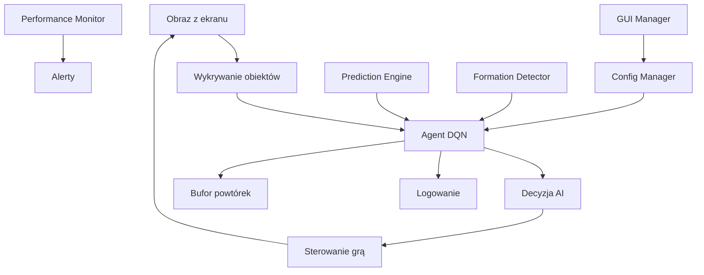

# Space Invaders AI Pro v3.0

Zaawansowany system sztucznej inteligencji do gry Space Invaders, oparty na Deep Q-Learning (DQN), z rozbudowanym monitoringiem, automatyzacją i testami. Projekt umożliwia pełną automatyzację rozgrywki w klasyczną wersję Space Invaders uruchamianą w DOSBox, analizę obrazu ekranu, podejmowanie decyzji przez agenta AI oraz logowanie i testowanie skuteczności algorytmu.

## 🚀 Nowości w wersji 3.0

### ✨ Zaawansowane funkcje
- **Interfejs GUI** - Kontrola parametrów w czasie rzeczywistym
- **Monitor wydajności** - Śledzenie FPS, CPU, pamięci i VRAM
- **System konfiguracji** - Dynamiczne zarządzanie parametrami
- **Zaawansowane algorytmy CV** - Lepsze wykrywanie obiektów
- **Predykcja ruchu wrogów** - Antycypacja zachowań przeciwników
- **Analiza formacji** - Wykrywanie wzorców wroga
- **System alertów** - Automatyczne powiadomienia o problemach

### 🔧 Ulepszenia techniczne
- **Modularna architektura** - Łatwiejsze rozszerzanie funkcji
- **Obsługa błędów** - Robustne zarządzanie wyjątkami
- **Optymalizacja pamięci** - Lepsze zarządzanie zasobami
- **Wielowątkowość** - Asynchroniczne operacje
- **Backup i restore** - Automatyczne kopie zapasowe

## Opis

Space Invaders AI Pro v3.0 to zaawansowane narzędzie badawcze i demonstracyjne, które pozwala na:
- Automatyczne sterowanie grą Space Invaders przez agenta AI
- Wykrywanie i analizę elementów gry (gracz, wrogowie, wynik, życia) na podstawie obrazu ekranu
- Uczenie agenta poprzez system nagród i kar
- Logowanie przebiegu rozgrywki i wyników
- Łatwą rozbudowę o własne algorytmy uczenia
- Monitoring wydajności w czasie rzeczywistym
- Interfejs graficzny do kontroli parametrów

Projekt jest modularny, łatwy do testowania i rozbudowy. Może służyć jako baza do eksperymentów z reinforcement learningiem, computer vision oraz automatyzacją gier retro.

## Główne funkcje
- **Deep Q-Learning (DQN):** Agent uczy się optymalnych akcji na podstawie obrazu ekranu i systemu nagród
- **Wykrywanie obiektów:** Detekcja gracza, wrogów, wyniku i żyć z użyciem OpenCV
- **Automatyzacja sterowania:** Symulacja klawiszy i myszki do sterowania grą
- **Monitoring i logowanie:** Szczegółowe logi, możliwość analizy postępów uczenia
- **Testy jednostkowe:** Moduł testów do walidacji funkcji AI
- **Konfigurowalność:** Łatwe dostosowanie parametrów przez pliki konfiguracyjne
- **Interfejs GUI:** Kontrola parametrów w czasie rzeczywistym
- **Monitor wydajności:** Śledzenie zasobów systemowych
- **Predykcja ruchu:** Antycypacja zachowań wrogów
- **Analiza formacji:** Wykrywanie wzorców przeciwników

## Struktura projektu

```
space-invaders-ai-pro/
├── main.py                 # Główny plik uruchamiający AI v3.0
├── game_ai.py             # Główna logika AI
├── ai/                    # Algorytmy AI
│   ├── agent.py           # Agenty DQN
│   ├── ai_utils.py        # Narzędzia AI
│   ├── prediction.py      # Predykcja ruchu
│   ├── reward.py          # System nagród
│   └── ...
├── core/                  # Podstawowe moduły
│   ├── controller.py      # Sterowanie
│   ├── screen_utils.py    # Przechwytywanie ekranu
│   └── logger.py          # System logowania
├── utils/                 # Narzędzia pomocnicze
│   ├── performance_monitor.py  # Monitor wydajności
│   ├── config_manager.py      # Zarządzanie konfiguracją
│   └── gui_manager.py         # Interfejs GUI
├── configs/               # Pliki konfiguracyjne
│   ├── config.yaml        # Główna konfiguracja
│   └── config.py          # Stałe konfiguracyjne
└── tests/                 # Testy jednostkowe
```

## Wymagania
- Python 3.8+
- OpenCV >= 4.8.0
- PyTorch >= 2.0.0
- pyautogui >= 0.9.54
- pygetwindow >= 0.0.9
- pytesseract >= 0.3.10
- mss >= 9.0.1
- PyYAML >= 6.0
- keyboard >= 0.13.5
- psutil >= 5.9.0
- tkinter (wbudowany w Python)

## Instalacja

### 1. Sklonuj repozytorium
```bash
git clone https://github.com/lonter100/space-invaders-ai-pro.git
cd space-invaders-ai-pro
```

### 2. Zainstaluj zależności
```bash
pip install -r requirements.txt
```

### 3. Uruchom grę Space Invaders w DOSBox

### 4. Uruchom AI
```bash
# Podstawowe uruchomienie
python main.py

# Z interfejsem GUI
python main.py --gui

# W trybie testowym
python main.py --test

# Z własną konfiguracją
python main.py --config custom_config.yaml

# W trybie debugowania
python main.py --debug
```

## Przykładowy zrzut ekranu


## Architektura



## Funkcje zaawansowane

### 🎯 Predykcja ruchu wrogów
- Śledzenie pozycji i prędkości wrogów
- Przewidywanie przyszłych pozycji
- Optymalizacja strzałów na podstawie predykcji

### 🎮 Analiza formacji
- Wykrywanie wzorców wroga (rząd, kolumna, klaster)
- Nagrody za rozbicie formacji
- Adaptacyjne strategie

### 📊 Monitor wydajności
- Śledzenie FPS w czasie rzeczywistym
- Monitorowanie użycia CPU i pamięci
- Alerty o problemach z wydajnością
- Generowanie raportów

### 🖥️ Interfejs GUI
- Kontrola parametrów AI w czasie rzeczywistym
- Wizualizacja statystyk
- Zarządzanie konfiguracją
- Monitoring wydajności

### ⚙️ System konfiguracji
- Dynamiczne zmiany parametrów
- Backup i restore konfiguracji
- Walidacja parametrów
- Profile konfiguracyjne

## Konfiguracja

### Plik config.yaml
```yaml
ai:
  learning_rate: 1.0e-4
  gamma: 0.99
  epsilon_start: 1.0
  epsilon_min: 0.05
  device: "auto"

vision:
  player_color_lower: [0, 0, 200]
  player_color_upper: [100, 100, 255]
  enemy_color_lower: [0, 200, 0]
  enemy_color_upper: [100, 255, 100]

performance:
  enable_monitoring: true
  fps_threshold: 30.0
  memory_threshold: 80.0
```

## Testowanie

### Uruchom testy
```bash
python -m pytest tests/
```

### Testy wydajnościowe
```bash
python main.py --test --performance
```

## Rozwijanie projektu

### Dodanie nowego algorytmu AI
1. Utwórz nową klasę w `ai/`
2. Zaimplementuj interfejs agenta
3. Dodaj do `get_best_agent()` w `ai/agent.py`

### Dodanie nowej funkcji CV
1. Utwórz funkcję w `ai/ai_utils.py`
2. Dodaj testy w `tests/`
3. Zaktualizuj dokumentację

## Licencja
MIT

---
Autor: lonter100

## Changelog

### v3.0 (2024-01-XX)
- ✨ Dodano interfejs GUI
- ✨ Dodano monitor wydajności
- ✨ Dodano system konfiguracji
- ✨ Dodano predykcję ruchu wrogów
- ✨ Dodano analizę formacji
- 🔧 Przepisano architekturę na modułową
- 🔧 Dodano obsługę błędów
- 🔧 Zoptymalizowano wydajność
- 🐛 Naprawiono błędy rozpakowywania wartości

### v2.0 (2024-01-XX)
- ✨ Dodano Deep Q-Learning
- ✨ Dodano system nagród
- ✨ Dodano wykrywanie obiektów
- 🔧 Poprawiono strukturę kodu
- 🐛 Naprawiono błędy

### v1.0 (2024-01-XX)
- 🎉 Pierwsza wersja
- ✨ Podstawowe sterowanie
- ✨ Wykrywanie ekranu 